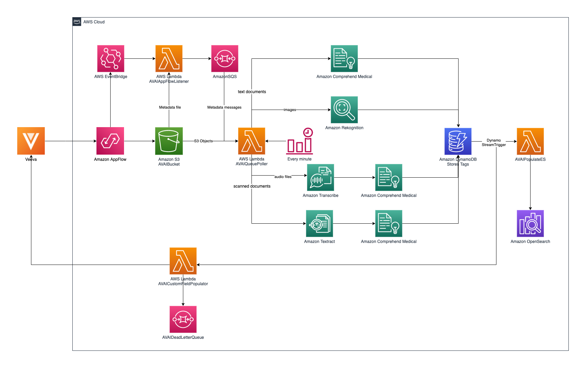
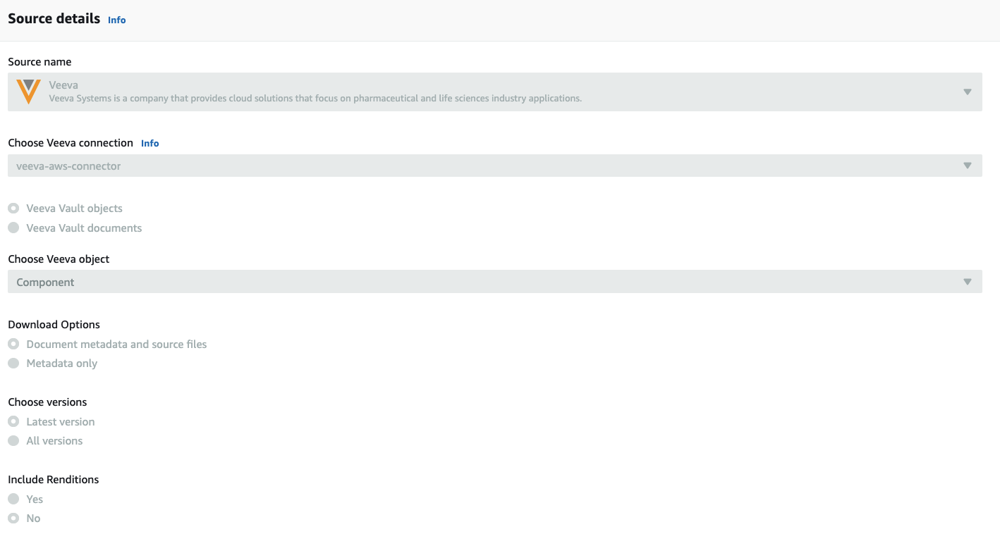
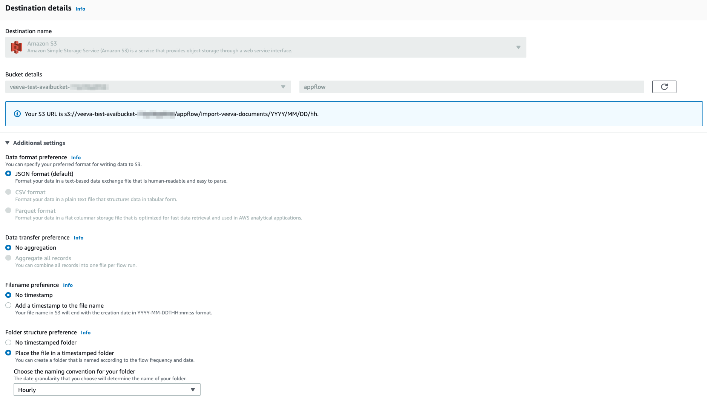
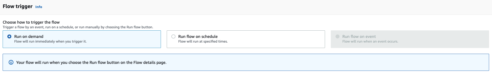
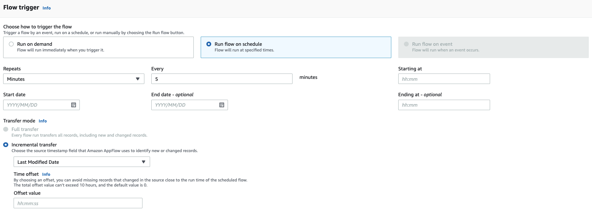

# aws-ai-appflow-veeva-integration
An integration between Veeva Vault and AWS, levaraging Amazon AppFlow to import assets and AWS AI services to intelligently analyze images, PDFs and audio assets.

# Background

In the [previous blog post](https://aws.amazon.com/de/blogs/machine-learning/analyzing-and-tagging-assets-stored-in-veeva-vault-promomats-using-amazon-ai-services/), we talked about analyzing and tagging assets stored in Veeva Vault PromoMats using Amazon AI services leveraging Veeva Vault Platforms APIs. In this blog post, we will explore how customers are leveraging [Amazon AppFlow](https://aws.amazon.com/appflow/), a fully managed integration service that enables you to securely transfer data between Software-as-a-Service (SaaS) applications like Veeva Vault, to achieve integration between Veeva and AWS in a easier and seamless fashion. 

# Overview of solution
The following diagram illustrates the solution architecture. 



Previously, in order to import assets from Veeva Vault you would have to write your own custom code logic leveraging the [Veeva Vault APIs](https://developer.veevavault.com/api/19.3/) in order to poll for changes in the data and import the data into S3. This could be a manual, time-consuming process, in which you had to account for API limitations, failures and retries, as well as scalability to accommodate an unlimited amount of assets. This solution leverages [Amazon AppFlow](https://aws.amazon.com/appflow/) instead to abstract away the complexity of maintaining a Veeva to S3 data import pipeline. 

Amazon AppFlow is a simple, no-code, self-service tool that uses point-and-click configurations to move data easily and securely between various SaaS applications you commonly use in your business and AWS services. It has built-in connection logic that can pull data (objects and documents) from a supported source to a supported destination. The supported source and destination could be a SaaS application or an AWS service such as Amazon S3, Amazon Redshift, or Amazon Lookout for Metrics. In addition to the no-code interface, Amazon AppFlow supports configuration via API, CLI and CloudFormation interfaces. 

In the case of this architecture, a flow has already been preconfigured using the CloudFormation template. A “flow” describes how data is moved, including the source, destination, any information needed to authenticate user access to source or destination, flow triggers (on demand, events, or a schedule), and data processing tasks such as check-pointing, field validation, or masking. When triggered, Amazon AppFlow executes a “flow run,” which calls APIs to get data from the source, runs data processing tasks, and transfers processed data to the destination.

Below are screenshots of the configuration of the flow that the solution template creates out of the box:



The flow uses Veeva as a Source and is configured to import *Veeva Vault Component Objects*. Both the metadata and source files themselves are necessary in order to keep track of the assets that have been processed and push tags back on the correct corresponding asset in the Source system. In this situation only the latest version is being imported and Renditions are not included. 



The flow uses the S3 bucket that is created as part of the CloudFormation template as a destination, does not aggregate records and uploads the files under a formatted path structure with an *hourly* granularity. The granularity can be modified according to specific needs. 



Finally, the flow is triggered on demand for demonstration purposes. This can be modified so that the flow runs on a schedule, with a maximum granularity of five minutes. When triggered on a schedule, the transfer mode changes automatically from a full transfer to an incremental transfer mode. You would have to choose a source timestamp field for tracking the changes. For the tagging use case, we found that the *Last Modified Date* is the most suitable.



Amazon AppFlow can integrate with [Amazon EventBridge](https://aws.amazon.com/eventbridge/) to publish events whenever a flow run is completed. Below you have an example of the message format for these events:

```
{
    "version": "0",
    "id": "d314f162-1ab3-0f90-b46d-f5fc70512f10",
    "detail-type": "AppFlow End Flow Run Report",
    "source": "aws.appflow",
    "account": "XXXXXXXXXXXX",
    "time": "2021-08-24T09:06:21Z",
    "region": "us-east-1",
    "resources": [
        "12816f196abcfb429e2ab7d71a8b3493"
    ],
    "detail": {
        "flow-name": "veeva-demo",
        "created-by": "arn:aws:sts::XXXXXXXXXXXX:assumed-role/Admin/Admin-Role",
        "flow-arn": "arn:aws:appflow:XXXXXXXXXXXX:us-east-1:flow/veeva-demo",
        "source": "VEEVA/veeva-appflow-connection",
        "destination": "S3",
        "source-object": "documents/types/component__c",
        "destination-object": "s3://veeva-test-avaibucket-XXXXXXXXXXXX",
        "trigger-type": "ONDEMAND",
        "num-of-records-processed": "17",
        "execution-id": "9aa00099-9943-449a-9c7a-488dbc801242",
        "num-of-records-filtered": "0",
        "start-time": "2021-08-24T09:02:47.643Z[UTC]",
        "num-of-documents-processed": "29",
        "end-time": "2021-08-24T09:06:20.871Z[UTC]",
        "num-of-record-failures": "0",
        "data-processed": "36406626",
        "status": "Execution Successful"
    }
}
```

For better resiliency, the ** AVAIAppFlowListener ** Lambda function is wired into EventBridge. On an AppFlow event being triggered, it verifies that the specific flow run has been executed successfully, reads the metadata information of all imported assets on that specific flow run and pushes individual document metadata into an [Amazon Simple Queue Service (Amazon SQS)](https://aws.amazon.com/sqs/) queue. Using Amazon SQS provides a loose coupling between the producer and processor sections of the architecture and also allows you to deploy changes to the processor section without stopping the incoming updates.

A second poller function (AVAIQueuePoller) reads the SQS queue at frequent intervals (every minute) and processes the incoming assets. Depending on the incoming message type, the solution uses various AWS AI services to derive insights from your data. Some examples include:

* **Text files** – The function uses the `DetectEntities` operation of Amazon Comprehend Medical, a natural language processing (NLP) service that makes it easy to use ML to extract relevant medical information from unstructured text. This operation detects entities in categories like Anatomy, Medical_Condition, Medication, Protected_Health_Information, and Test_Treatment_Procedure. The resulting output is filtered for Protected_Health_Information, and the remaining information, along with confidence scores, is flattened and inserted into an Amazon DynamoDB table. This information is plotted on the OpenSearch Kibana cluster. In real-world applications, you can also use the Amazon Comprehend Medical ICD-10-CM or RxNorm feature to link the detected information to medical ontologies so downstream healthcare applications can use it for further analysis. 
* **Images** – The function uses the `DetectLabels` method of Amazon Rekognition to detect labels in the incoming image. These labels can act as tags to identify the rich information buried in your images. If labels like Human or Person are detected with a confidence score of more than 80%, the code uses the DetectFaces method to look for key facial features such as eyes, nose, and mouth to detect faces in the input image. Amazon Rekognition delivers all this information with an associated confidence score, which is flattened and stored in the DynamoDB table.
* **Voice recordings** – For audio assets, the code uses the `StartTranscriptionJob` asynchronous method of Amazon Transcribe to transcribe the incoming audio to text, passing in a unique identifier as the TranscriptionJobName. The code assumes the audio language to be English (US), but you can modify it to tie to the information coming from Veeva Vault. The code calls the `GetTranscriptionJob` method, passing in the same unique identifier as the TranscriptionJobName in a loop, until the job is complete. Amazon Transcribe delivers the output file on an S3 bucket, which is read by the code and deleted. The code calls the text processing workflow (as discussed earlier) to extract entities from transcribed audio.
* **Scanned documents (PDFs)** – A large percentage of life sciences assets are represented in PDFs—these could be anything from scientific journals and research papers to drug labels. Amazon Textract is a service that automatically extracts text and data from scanned documents. The code uses the `StartDocumentTextDetection` method to start an asynchronous job to detect text in the document. The code uses the JobId returned in the response to call `GetDocumentTextDetection` in a loop, until the job is complete. The output JSON structure contains lines and words of detected text, along with confidence scores for each element it identifies, so you can make informed decisions about how to use the results. The code processes the JSON structure to recreate the text blurb and calls the text processing workflow to extract entities from the text.

A DynamoDB table stores all the processed data. The solution uses DynamoDB Streams and AWS Lambda triggers (AVAIPopulateES) to populate data into an OpenSearch Kibana cluster. The AVAIPopulateES function is fired for every update, insert, and delete operation that happens in the DynamoDB table and inserts one corresponding record in the OpenSearch index. You can visualize these records using Kibana.

In order to close the feedback loop, the `AVAICustomFieldPopulator` Lambda function has been created. It is triggered by events in the DynamoDB stream of the metadata DynamoDB table. For every DocumentID in the DynamoDB records the function tries to upsert tag information into a predefined custom field property of the asset with the corresponding ID in Veeva, using the Veeva API. To avoid inserting noise into the custom field, the Lambda function filters any tags that have been identified with a confidence score of lower than `0.9`. Failed requests are forwarded to a Dead Letter Queue for manual inspection or automatic retry. 

This solution offers a serverless, pay-as-you-go approach to process, tag, and enable comprehensive searches on your digital assets. Additionally, each managed component has high availability built in by automatic deployment across multiple Availability Zones. For Amazon OpenSearch Service, you can choose the three-AZ option to provide better availability for your domains.

# Deployment and Execution

You use SAM to deploy the solution. SAM creates all the necessary resources, including:

* An S3 bucket to store the incoming assets.
* An AppFlow flow to automatically import assets into the S3 bucket
* An EventBridge Rule together with a lambda function to react to the events generated by AppFlow (`AVAIAppFlowListener`)
* An SQS FIFO queue to act as a loose coupling between the listener function (`AVAIAppFlowListener`) and the poller function (`AVAIQueuePoller`).
* A DynamoDB table to store the output of Amazon AI services.
* An Amazon OpenSearch Kibana (ELK) cluster to visualize the analyzed tags.
* A Lambda function to push back identified tags into Veeva (`AVAICustomFieldPopulator`), together with a corresponding DLQ
* Required Lambda functions:
    * **AVAIAppFlowListener** – Triggered by events pushed y the AppFlow service to EventBridge. Used for flow run validation and pushing a message to the SQS queue.
    * **AVAIQueuePoller** – Triggered every 1 minute. Used for polling the SQS queue, processing the assets using Amazon AI services, and populating the DynamoDB table.
    * **AVAIPopulateES** – Triggered when there is an update, insert, or delete on the DynamoDB table. Used for capturing changes from DynamoDB and populating the ELK cluster.
    * **AVAICustomFieldPopulator** - Triggered when there is an update, insert, or delete on the DynamoDB table. Used for feeding back tag information into Veeva
* The Amazon CloudWatch Events rules that trigger AVAIPoller and AVAIQueuePoller. These triggers are in the **DISABLED** state for now. 
* Required IAM roles and policies for interacting AI services in a scoped-down manner.


## Prerequisites

1. Download and install the latest version of Python for your OS from [here](https://www.python.org/downloads/). We shall be using Python 3.8 and above.

2. You will be needing [AWS CLI version 2](https://docs.aws.amazon.com/cli/latest/userguide/cli-chap-install.html) as well. If you already have AWS CLI, please upgrade to a minimum version of 2.0.5 follwing the instructions on the link above.

3. Install the [AWS SAM CLI](https://docs.aws.amazon.com/serverless-application-model/latest/developerguide/serverless-sam-cli-install.html).

## Instructions

### Deployment 
1. Download the contents of this repository on your local machine (say: project-directory)
2. Open a command prompt, navigate to the project directory. Navigate to the `/code` subdirectory and run: 
    ```bash
    sam build
    sam deploy --guided
    ```
    Follow the instructions on screen and provide the missing values (stack name, region, domain, username, password, custom tag). 
    When prompted to `Allow SAM CLI IAM role creation [Y/n]:`, select `Y` otherwise the deployment will fail. 
    You can save your preferences in a `samconfig.toml` file to reuse between runs.
3. If you want to make changes to the Lambda functions, you can do so on your local machine and redeploy using the command `sam deploy` (uses the `samconfig.toml` file create before). 

## Further Reading:
1. Previous blogpost: [Analyzing and tagging assets stored in Veeva Vault PromoMats using Amazon AI services](https://aws.amazon.com/blogs/machine-learning/analyzing-and-tagging-assets-stored-in-veeva-vault-promomats-using-amazon-ai-services/)
2. New blogpost: [Analyze and tag assets stored in Veeva Vault PromoMats using Amazon AppFlow and Amazon AI Services](https://aws.amazon.com/blogs/machine-learning/analyze-and-tag-assets-stored-in-veeva-vault-promomats-using-amazon-appflow-and-amazon-ai-services/)

## License

This library is licensed under the Apache 2.0 License. 

## Terms and Conditions

This solution uses the face detection feature of Amazon Rekognition. Please review the [Terms and Conditions](https://aws.amazon.com/service-terms/) for the service. 
